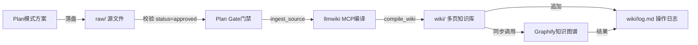

# zhishiku 知识库功能说明

## 整体架构



| 组件 | 职责 | 位置 |
|------|------|------|
| **Plan Gate** | 门禁：仅批准源可编译 | `.cursor/rules/plan-gate.mdc` |
| **llmwiki MCP** | 编译管线 | Cursor mcp.json 配置 |
| **Graphify** | 知识图谱 | `.cursor/rules/graphify.mdc` |
| **zhishiku** | 上述三者的操作级约束 | `.cursor/SKILL/zhishiku/SKILL.md` |

## 核心原则

1. **编译唯一入口**：`ingest_source` → `compile_wiki`，禁止手搓多页或 Shell CLI 绕过
2. **单行 ingest**：`ingest_source` 目标必须是单个 `raw/YYYY-MM-DD_*.md`，不是整本 `plan-log.md`
3. **raw 与 wiki 同步**：落盘 raw 后同一轮内必须调 MCP 编译，不得只落盘不改 wiki
4. **手改边界**：仅导航/概览页可手改对齐；主体知识页靠编译管线产出
5. **图谱互补**：llmwiki 负责编译，Graphify 负责实体完整性校验，互不替代

## llmwiki MCP 工具矩阵

| 能力 | MCP 工具 | 使用场景 | 是否需要 LLM |
|------|-----------|----------|-------------|
| 导入源 | `ingest_source` | 新 raw 文件进编译器 sources 侧 | 否 |
| 编译生成 | `compile_wiki` | 增量编译，生成多页 wiki | 是 |
| 库摘要 | `wiki_status` | 巡检全库状态（页数、变更等） | 否 |
| 规则质检 | `lint_wiki` | 坏链、孤儿页检查 | 否 |
| 章节搜索 | `search_pages` | 按主题语义筛选相关页 | 是 |
| 单页精读 | `read_page` | 已知 slug 时读单页内容 | 否 |
| 问答 | `query_wiki` | 基于 wiki 的自然语言回答，可选落盘 | 是 |

## Graphify 模型

### 实体类型

| 实体 | 页面路径 | 说明 |
|------|----------|------|
| `Solution` | `wiki/solutions/*` | 执行方案页 |
| `Tech` | `wiki/tech/*` | 技术知识页 |
| `Task` | `wiki/tasks/*` | 任务页 |
| `Source` | `wiki/sources/*` | 原始方案摘要页 |
| `GlossaryTerm` | `wiki/glossary.md` 拆分项 | 术语项 |

### 关系类型与方向

| 关系 | 方向 | 语义 |
|------|------|------|
| `source_summarizes` | Source → Solution | 源概括方案 |
| `solution_uses` | Solution → Tech | 方案使用技术 |
| `solution_has_task` | Solution → Task | 方案包含任务 |
| `task_depends_on` | Task → Task | 任务依赖 |
| `term_described_in` | GlossaryTerm → Solution | 术语在方案中描述 |
| `tech_related_to` | Tech → Tech | 技术间关联 |

### Frontmatter 字段

所有 wiki 页面 frontmatter 应包含：

- `graph_id` — 格式 `{entity_type}:{slug}`，全局唯一；重命名不变更
- `entity_type` — 仅 5 类实体名
- `schema_version` — 默认 `1.0`，格式 `主版本.次版本`
- `relations` — 数组 `{relation, target_graph_id}`
- `source_ref` — Source 实体必填，对应 raw 路径
- `title` — 页面标题
- `status` — 仅 `active` / `archived` / `deprecated`；Solution、Task、Source 必填

### 入库时机

- 每创建或更新 wiki 页面 → 同步 upsert 实体
- 每新增双链 → 同步 upsert 关系
- 页面删除 → 软删除（`status=archived`），图谱节点保留
- 页面重命名 → 只更新 title/path，不变更 graph_id
- 重复导入同一 raw → 幂等，不得新增重复节点或边

### 最小验收标准

| 条件 | 要求 |
|------|------|
| 孤立节点 | 0 个（Source 允许 24h 临时孤立） |
| Solution 完整性 | 至少关联 1 个 Tech + 1 个 Task |
| index 一致性 | `wiki/index.md` 统计数量与图谱实体数量一致 |
| 日志记录 | 每次导入须写入 `wiki/log.md` |

## 日志规范

### 格式

```
时间戳 | raw_source | updated_pages | added_nodes | added_edges | validation | status
```

### 字段枚举

| 字段 | 允许值 |
|------|--------|
| `validation` | `pass`、`warn`、`fail` |
| `status` | `success`、`partial_success`、`failed` |
| `updated_pages` | 0 或正整数 |
| `added_nodes` | 0 或正整数 |
| `added_edges` | 0 或正整数 |

`status=failed` 时，`validation` 必须为 `fail`。

### 示例

```
2026-05-01T21:20:00+08:00 | raw/2026-05-01_示例方案.md | 6 | 9 | 14 | pass | success
```

## 异常码

| 码 | 含义 | 处置 | 日志级别 |
|----|------|------|---------|
| `E_GRAPH_001` | graph_id 缺失/不合法 | 阻断图谱写入 | failed |
| `E_GRAPH_002` | entity_type 不在允许集合 | 阻断图谱写入 | failed |
| `E_GRAPH_003` | 关系名或方向不合法 | 拒绝该关系 | warn |
| `E_GRAPH_004` | 重复三元组写入 | 跳过新增边 | pass |
| `E_GRAPH_005` | 图谱写入失败 | wiki 继续更新，记 graph_sync_failed | 标记 |
| `E_GRAPH_006` | 最小验收不通过 | 记录 failed 并标记待修复 | failed |

## 排序与稳定输出

- 实体输出顺序：`Solution` → `Tech` → `Task` → `Source` → `GlossaryTerm`
- 同类型按 `graph_id` 字典序升序
- `relations` 按 `relation + target_graph_id` 字典序升序
- 同一 raw 多次导入、内容无变化时不得产生结构性 diff
